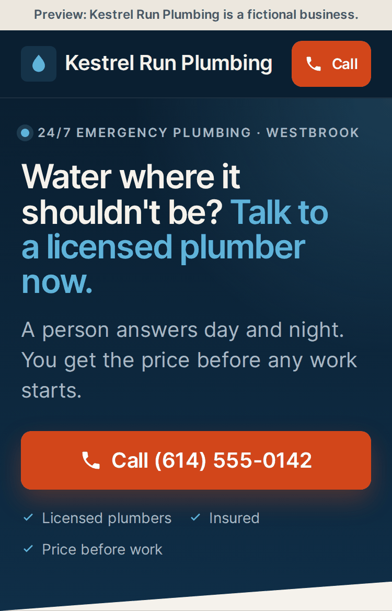
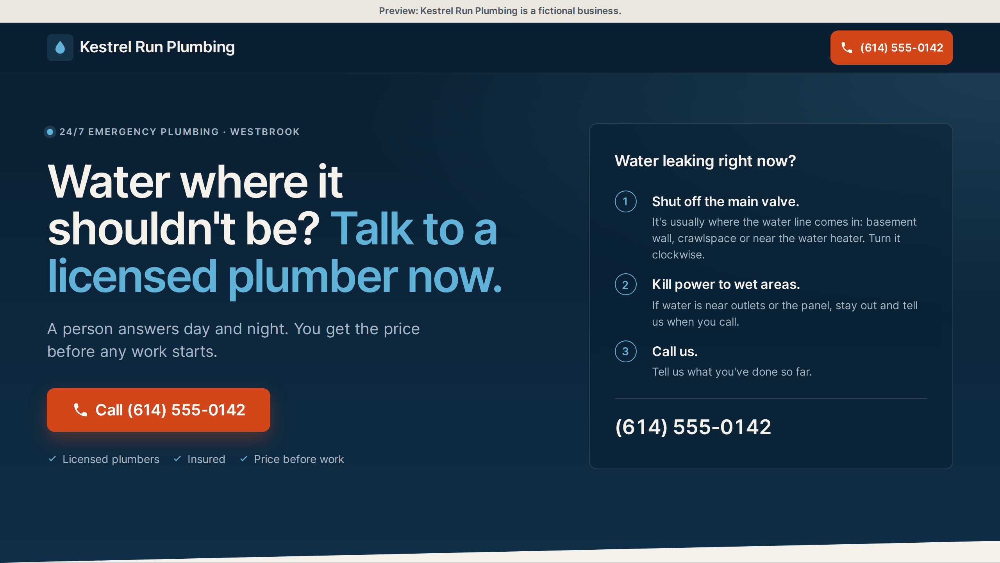

# Free plumber homepage sample

  
  

These are screenshots. Open [`preview.html`](preview.html) for the live page.

This is a small, usable slice of the Plumber Site Pack for building a local plumber's homepage with Claude Code. It includes design tokens, the header and call button hero, one headline pattern, and the evidence for those choices. The sample is MIT licensed; the full pack has its own license.

## 30-second quickstart

1. Copy this folder into your project as `plumber-sample/`.
2. Tell Claude Code: "Build my client's homepage using ./plumber-sample/AGENTS.md."
3. Give it the client's real name, phone number and promises when it asks.

Open [the header and hero preview](preview.html) to see the included pieces together with fictional details.

## Install as a Claude Code skill
You can also install the folder once as a skill, so you don't have to point Claude Code at it each time:

1. Copy this folder to `.claude/skills/plumber-site-pack-sample/` in the client's project, or to
   `~/.claude/skills/plumber-site-pack-sample/` to use it in every project.
2. Ask Claude Code: *"Build my client's plumber homepage."* The skill loads when a request matches it, and
   `SKILL.md` points Claude Code to `AGENTS.md`.

## What the full pack adds

Eight more components:

- `03-trust-strip`
- `04-problems`
- `05-request-form`
- `06-how-it-works`
- `07-service-area`
- `08-reviews`
- `09-footer`
- `10-call-dock`

Five more copy patterns: `call-button`, `problems`, `request-form`, `service-area`, `trust-strip`.

It also adds full evidence for the full design. [Get the full plumber pack for $49](https://designpack.cowerx.dev/design-pack/).
